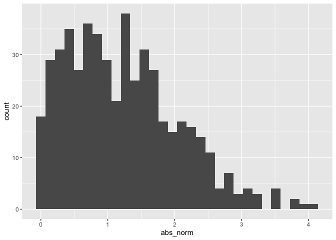

Simple document
================

I’m an R Markdown document!

# Section 1

Here’s a **code chunk** that samples from a *normal distribution*:

``` r
samp = rnorm(100)
length(samp)
```

    ## [1] 100

# Section 2

I can take the mean of the sample, too! The mean is 0.06.

# Section 3

This is going to make a plot. First I generate a dataframe, then use
\`ggplot to make a scatterplot.

## Plots from last time

<!-- -->

### Plot for Learning Assessment

This is a quick solution to learning assessment.

``` r
la_df<-
  tibble(
    norm=rnorm(n=500,mean=1),
    logical=norm>0,
    abs_norm=abs(norm)
  )

ggplot(la_df,aes(x=abs_norm))+geom_histogram()
```

    ## `stat_bin()` using `bins = 30`. Pick better value with `binwidth`.

<!-- -->

Here’s a list:

-   Item 1
-   Item 2
    -   sub item 1
